## Chronicle-Engine-GUI

// Settings:
:experimental:
:idprefix:
:idseparator: -
ifndef::env-github[:icons: font]
ifdef::env-github,env-browser[]
:toc: macro
:toclevels: 1
endif::[]
ifdef::env-github[]
:status:
:outfilesuffix: .adoc
:!toc-title:
:caution-caption: :fire:
:important-caption: :exclamation:
:note-caption: :paperclip:
:tip-caption: :bulb:
:warning-caption: :warning:
endif::[]
// Aliases:
:project-name: Asciidoctor PDF
:project-handle: asciidoctor-pdf
 
toc::[]

You first have to start a Chronicle Engine, for example, go to the chronicle engine project and run
the main of :
[source, console]
----
Chronicle-Engine/src/test/java/net/openhft/chronicle/engine/StartEngineWithDummyData.java
----
A web based client management console to start the jetty application server, please
[source, console]
----
mvn compile jetty:run
----

Then in your web-brower go to http://localhost:8080, if you are running using "StartEngineWithDummyData" ( see above ) 

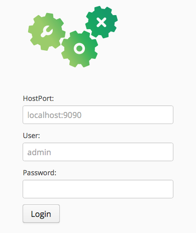
you should be able to just use the defaults. Click on "Login".

## Screenshots
### Chart

image::images/chart.png[]

### Chronicle Map
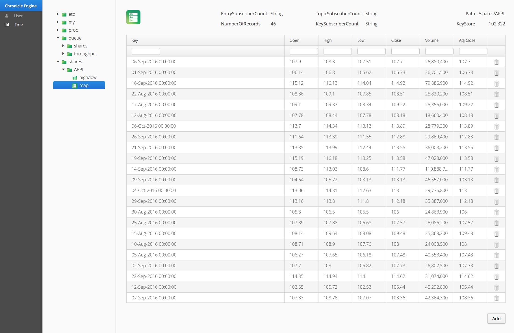

### Network Latency

Network latency charts are only available when using queue replication, to measure network latency requires measuring the round trip time of replication events. Hence, network latency is only recorded for messages that are acknowledged. To see more about chronicle-queue message acknowledgement, see :

[source, java]
----
net.openhft.chronicle.queue.impl.WireStore.lastAcknowledgedIndexReplicated()
----

Queue-Replication is required to create data that can produce network traffic, you can run  ( the following : )

[source, console]
----
Chronicle-Queue-Enterprise/src/test/java/net/openhft/chronicle/engine/StartEngineWithDummyData.java
----

This has to be run from the chronicle-queue-enterprise project ( Note: chronicle-queue-enterprise is a licensed project, if you wish to purchase a licence please contact sales@chronicle.software) 

image::images/network-latency.png[]

###  Data Filtering

Below are some examples for range searching

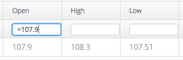
a short hand for the above is  :

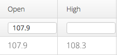

if you want to find all values greater than say " 107.9", you can write this

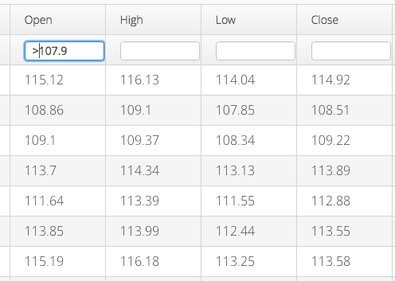

if you want to also filter it to only show values greater than "107.9"  and less than "110"

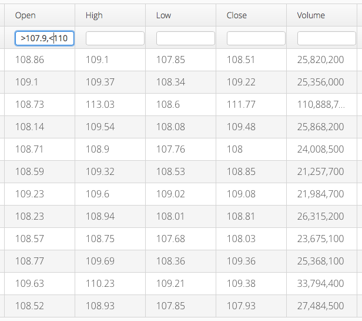

another way to write the same thing is :

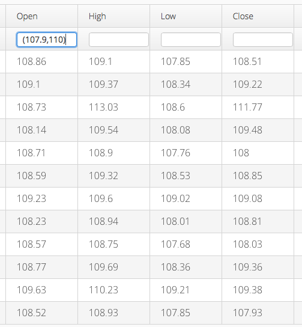

we also support this inclusive "[" and exclusive "(" formats like below )

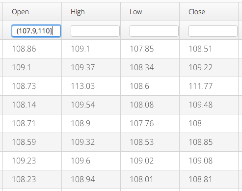

The time sample columns that feature a Long ( which is time in UTC milliseconds since epoch ),
can be edited by clicking of the filter box, the following search dialog will appear :

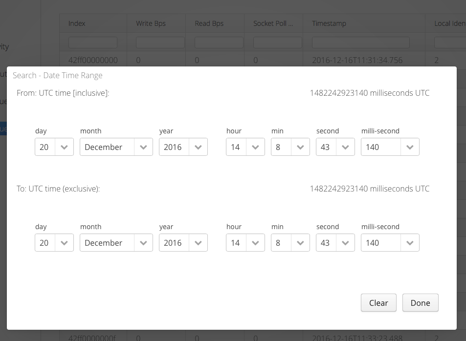

once you click done you will see the  UTC milliseconds range that this generates, for example

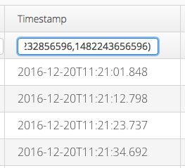

###  Data Ordering

If you click on the title this will order the data in your chart, click the title for second time
 will rerver the order of the data

image::images/simple-ordering.png[]

further more if you click on another title and hold down the SIFT key, you get set up ordering on
 both titles at the same time, you can repeat this process across as many columns as you have

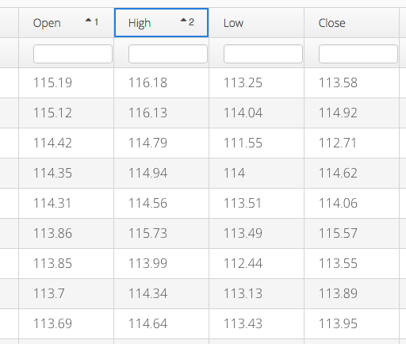

###  vaadin-charts

WARNING: this project requires the following artifact

A licenced version of this artifact can be obtained from https://vaadin.com/framework

[source, console]
----
<dependency>
	<groupId>com.vaadin.addon</groupId>
	<artifactId>vaadin-charts</artifactId>
	<version>3.2.0</version>
</dependency>
----
``
